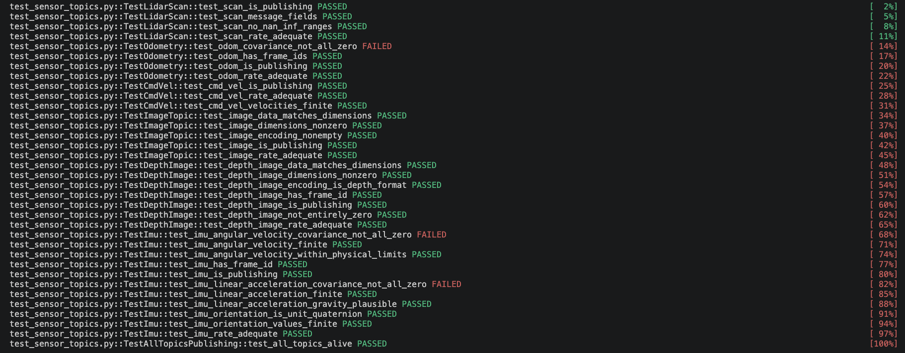
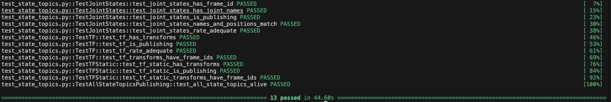

# robot_sensor_state_checks

> Integration tests that validate ROS 2 sensor and state topics are publishing at expected rates and checks the health of each sensor.

---

## Overview

`robot_sensor_state_checks` is a pytest-based integration test suite for ROS 2 simulation stacks. It automatically **fails** if any topic is dead, publishing below the minimum rate, or producing malformed data.

---

## Package Structure

```
robot_sensorstate_checks/
└── robot_sensorstate_checks/
    ├── test_sensor_topics.py   # Sensor topic tests
    └── test_state_topics.py    # State topic tests
```

---

## What It Tests

### Sensor Topics — `test_sensor_topics.py`

| Topic | Message Type | Checks |
|---|---|---|
| `/scan` | `LaserScan` | Publishing, rate ≥ 5 Hz, valid ranges, no NaN/Inf |
| `/odom` | `Odometry` | Publishing, rate ≥ 10 Hz, frame IDs present |
| `/camera/image_raw` | `Image` | Publishing, rate ≥ 5 Hz, non-zero dimensions, encoding, data integrity |
| `/camera/depth/image_raw` | `Image` | Publishing, rate ≥ 5 Hz, depth encoding (`32FC1`/`16UC1`), no NaN/Inf, non-zero values, frame ID |
| `/cmd_vel` | `Twist` | Publishing, rate ≥ 1 Hz, all velocity fields are finite |
| `/imu/data` | `Imu` | Publishing, rate ≥ 50 Hz, frame ID, unit quaternion orientation, finite linear acceleration & angular velocity, physical range limits (±2000°/s), covariance populated or REP-145 sentinel present |

### State Topics — `test_state_topics.py`

| Topic | Message Type | Checks |
|---|---|---|
| `/joint_states` | `JointState` | Publishing, rate ≥ 3 Hz, joint names present, name/position count match |
| `/tf` | `TFMessage` | Publishing, rate ≥ 10 Hz, transforms present, frame IDs valid |
| `/tf_static` | `TFMessage` | Publishing (TRANSIENT_LOCAL QoS), transforms present, frame IDs valid |

---

## Requirements

- ROS 2 (Humble or later)  environment must be sourced before running
- Python 3.10+
- pytest

### Install Test Dependencies

```bash
pip install pytest
```

### Source your ROS 2 environment

```bash
source /opt/ros/<distro>/setup.bash
```

### Clone into your ROS 2 workspace

```bash
cd ~/ros2_ws/src
git clone https://github.com/Daviesss/robot_sensor_state_checks.git
```

### Build the package

```bash
cd ~/ros2_ws
colcon build --packages-select robot_sensorstate_checks
source install/setup.bash
```

---

## Running the Tests

> **The simulation/robot with the required sensors must be running before you execute the tests.** Launch your Gazebo world and robot stack first, then run the suite.

### Test Sensor Topics

```bash
cd robot_sensor_state_checks/robot_sensorstate_checks/robot_sensorstate_checks
python3 -m pytest test_sensor_topics.py -v
```


### Test State Topics

```bash
cd robot_sensor_state_checks/robot_sensorstate_checks/robot_sensorstate_checks
python3 -m pytest test_state_topics.py -v
```


### Run All Tests

```bash
python3 -m pytest test_sensor_topics.py test_state_topics.py -v
```

### Run via Shell Script

A convenience script is provided to source the environment and run all tests in one step:

```bash
cd robot_sensor_state_checks/robot_sensorstate_checks
chmod +x run_tests.sh
bash run_tests.sh
```

---

## Notes

### Odometry Covariance in Simulation

> `test_odom_covariance_not_all_zero` is **skipped** in simulation.

Gazebo publishes perfect ground truth odometry with no uncertainty, so all covariance values are zero by design. This is expected behaviour in simulation and is not a bug. The test is retained for use against real hardware where covariance should be populated.

### tf_static QoS

`/tf_static` uses `TRANSIENT_LOCAL` durability. The subscriber in this suite is configured to match. If you are writing your own subscriber for static transforms, ensure it also uses `TRANSIENT_LOCAL` a `VOLATILE` subscriber will miss the latched message entirely.

### IMU Covariance and REP-145

If your IMU plugin sets `gaussian_noise` to `0.0` for all axes, the covariance matrices will legitimately be all-zero. The test accepts this only if `covariance[0] == -1.0`  the REP-145 sentinel indicating the field is intentionally not provided. If neither condition is met, the test will fail and prompt you to either configure noise in your SDF or explicitly mark the field as not provided.

### Depth Image Encoding

Gazebo depth cameras publish as `32FC1` (32-bit float, metres). Real hardware (RealSense, OAK-D) typically publishes `16UC1` (16-bit unsigned, millimetres). Both encodings are accepted by the depth image tests.

---

## Testing on Real Hardware

The test suite works on real hardware with no code changes, provided your topics match the names defined in `TOPIC_CONFIG`.

### Steps

1. Source your ROS 2 environment and bring up your robot stack as normal
2. Verify your topics are live:

```bash
ros2 topic list
```

3. Run the tests:

```bash
cd robot_sensor_state_checks/robot_sensorstate_checks/robot_sensorstate_checks
python3 -m pytest test_sensor_topics.py test_state_topics.py -v
```

### Differences from Simulation

- `test_odom_covariance_not_all_zero` this test **will run and assert** on real hardware. Real odometry should have non-zero covariance values. If it fails, your odometry source is not populating covariance.
- IMU covariance tests will also fully assert , ensure your IMU driver populates covariance or sets the REP-145 sentinel (`covariance[0] = -1.0`).

### If Your Topic Names Differ

Update `TOPIC_CONFIG` at the top of each test file to match your hardware's topic names:

```python
TOPIC_CONFIG = {
    "scan": {
        "topic": "/your/scan/topic",   # change this
        ...
    },
}
```

## Why Not Just Use `ros2 topic hz` or `ros2 doctor`?

Those tools display information ...they require a human watching a terminal. This suite **asserts** conditions and **fails the pipeline automatically** if something is misconfigured or broken. It is the difference between a dashboard you check manually and a gate that blocks a bad merge.

---

## License

MIT

# TODO:
- A config YAML file so users can set topic names, rate thresholds, and timeouts without touching the Python files
- Command line arguments to select which topics to test